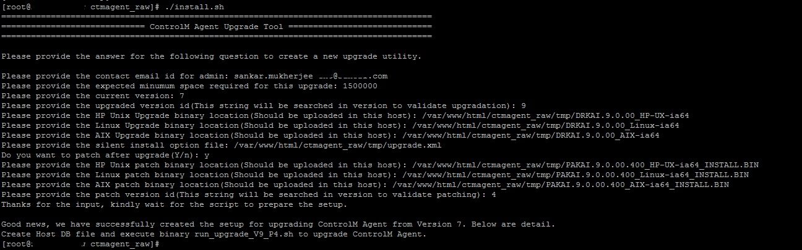
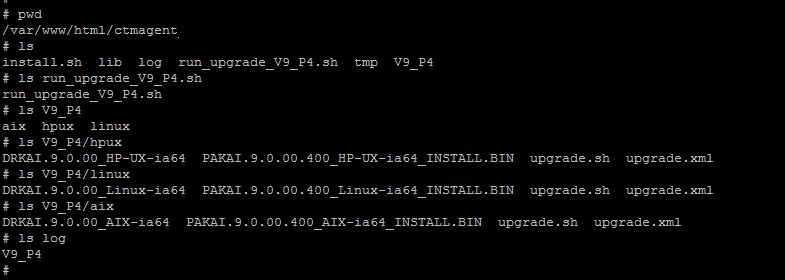
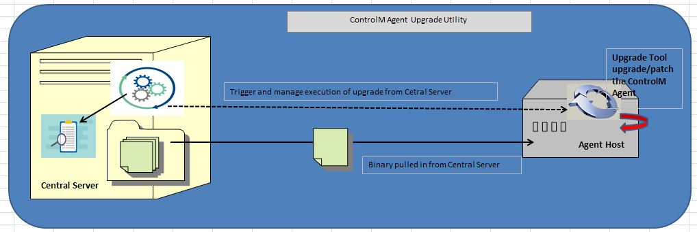
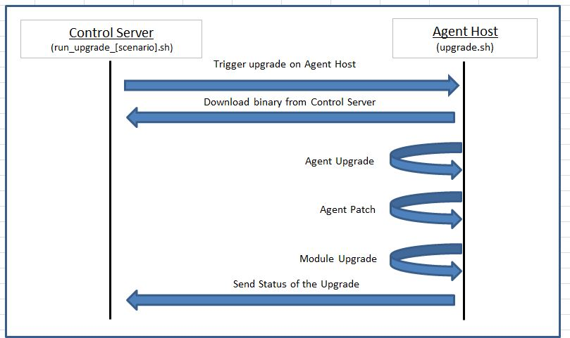
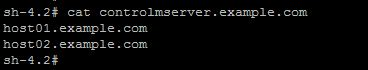
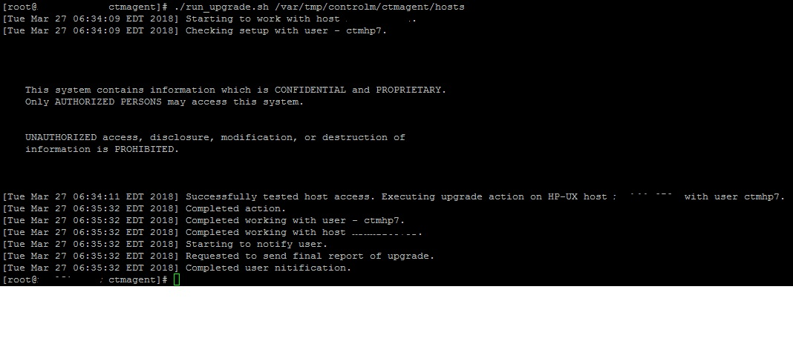
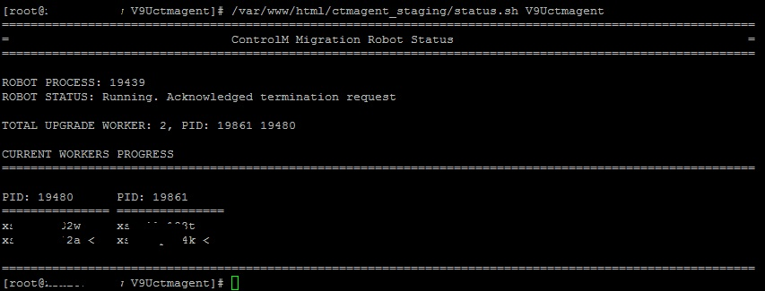
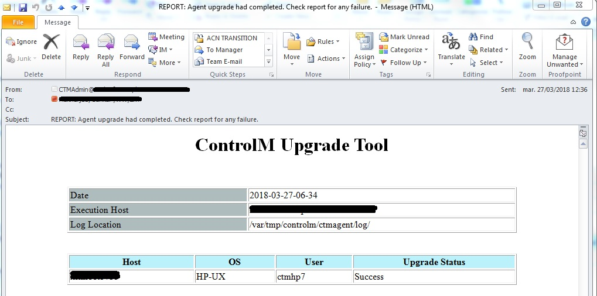

# BMC ControlM Agent Upgrade and Patch Utility

The utility will help perform the BMC ControlM Agent remote management. Any upgrade and/or patch activity can be performed using the utility over any number of agent server.

Table of Content

1. Overview

        1.1. Introduction
        
        1.2. Advantage
        
        1.3. Quick Installation
        
2. Tool technical overview

        2.1. Tool Directory layout
        
        2.2. Execution Process
        
        2.3. Robot Script
        
        2.4. Cleanup Migration Scenario
        
        2.5. Troubleshooting
        
3. Limitation and upgrade

4. Support and managebility

## 1. Overview

### 1.1. Introduction

Today even in a mid size enterprise using BMC ControlM scheduling tool we have hundreeds to thousand host configured with ControlM Agent. It poses a considerable challenge in upgrading, patching Agents manually.

If that is a problem you are facing then this tool is your solution. This tool will help in migration of Agent from any version to any version. You also have options to selectively upgrade/patch agents.

### 1.2. Advantage

Below are the basic advantages that the tool has:

        1. Completely configurable as to which is your source version and what is your target version.
        
        2. You can use the same tool to run multiple parallel version migration over a disjoin set of agents with different requirement.
        
        3. Extremely simple tool written with no additional requirements other than few basic Linux utility.
        
        4. Auditable inbuild logging support, report generation support.
        
        5. Tool follows a inbuild rollback mechanism incase failure in upgrade.
        
        6. No worry of unsuccessful upgrade/patch leave agent binary corrupted, tool raises immediate alert in case upgrade/rollback failure.
        
        7. All audit and logs visible and sharable via HTTP Interface thus easy access for the same.
        
        8. Option to use robot execution mode which can upgrade in managable parallel batches from a massive amount of agent upgrade request.
        9. Supports Control Module upgrade for Agents. Module upgrade requires same configuration like Agent upgrade.
        
        10. Module upgrade is a separate atomic operation and reports available seprately thus Agent upgrade success is not affected by Module upgrade.
        

### 1.3. Quick Installation

The tool has a extremely simple install process. It comprosed of three steps to be performed in the central server from where you are going to run your utility centrally. Note the central tool server is required to be Linux but note the tool can patch host of any available flavour Linux/HP_UX/AIX.

1. Install Apache(used to distribute binary to the agent host) and SSHPass Utility.

        yum -y install sshpass
        
        yum -y install httpd
        
        service httpd start
        
        chkconfig httpd on

2. Download the tool library and place it in your Apache Doc Root(i.e. /var/www/html/).

        cp -r ctmagent /var/www/html/ctmagent
        
        chown -R apache:apache /var/www/html/ctmagent
        
        chmod a+rx /var/www/html/ctmagent/install.sh
        
        
3. Configure the tool for a specific migration scenario by running the install.sh.
        
The installation setup actually lay down a skeleton for tool, from here on you should use the tool to create a miragtion scenario where you give the tool data about the next migration that you want to perform using the tool. Migration setup is build by runnning a install.sh script, this script gather details about your next planned migration and the data that is required for the same based on the information provided the tool setup and install the component for the migration you planned next.

The below execution trail shown below shows one such migration setup, note few important points below.
- You should upload the installation binary to the tool host from BMC and made available to the tool to set the same.
- In case if you do not have binary available for any perticular flavour, please create dummy file to be provided to the script. But note in case script detects any of your host of that flavour the patch will obviously as expected to fail.
        
Dummy walk through of the setup process:

        
Just to make you understand what all have been done lets view the directory structures along with files created with the setup process.

Before setup process:

After setup process:

As you see the below components are created:
- An lancher script to initate this migration scenario, you just need to create a host file and execute the migration(detail later).
- An directory containing sub folders for all flavour contains data to be transfered to the agent host and perform the actual migration.
- Log directory to preserve logs for this perticular migration scenario.

Note: All above operation need root priviledge on the tool host. 

## 2. Tool technical overview

The tool is build to migrate your ControlM agents from a centralised server. Thus what you do is to install this tool in a central server. Once installed you then create a migration scenario, a migration scenario is a perticular migration type consists of a perticular source version a destination version. Note in case you have provided the tool a host which doesnot match the correct current version the tool will not migrate the Agent.

The tool is build to execute the migration over hundreds or even thousands of agents server, thus the tool has a design to push the maximum computing over to the agent server itself rather than driving the whole process from the central server. The Central control server just initiates and monitors the execution. This architecture keeps the control server free of heavy comutation requirements. But its of prime importance to place your central server in a host where it can reach out to all your Agent hosts via SSH, while Agent host can reach your central server via HTTP. This is required because the tool connects to agent hosts via SSH and trigger migration task. While central server orders the action the agent hosts download the binaries required for the migration from the central server via HTTP.

The central control host is expected to be Linux and thats a requirement though there is not specific requirement for Agent hosts. In case you have issue in providing a Linux host as a central server, you should atleast make Bash shell available in the central control host. The requirement is present bacause the setup script is written in bash shell also the installtion steps will vary in case you are not using Linux.

The tool is build to migrate agents of flavour Linux/HP_UX/AIX. Thus the tool does not expects any specific requirement of any kind for the Agent hosts. The actual migration driver script is written in Bourne shell, which is available in all flavours. Note here though the actual driver script is kept fairly universal there is a specific version script provided for each flavour of Unix. 

### 2.1. Tool Directory layout

The tool comes with below list of directory and files and there purpose explained below:

[FILE] **install.sh** - This script creates a perticulat migration scenario, as shown above.

[FILE] **uninstall.sh** - This script uninstalls a perticulat migration scenario.

[FILE] **robot.sh** - This is the robot execution script, explained later.

[FILE] **status.sh** - This script helps in validating the status of a perticular robots execution.

[DIRECTORY] **lib** - This directory contains the skeleton scripts which will be used to create specific scripts for a perticular migration scenario.

[FILE] **lib/run_upgrade_[Migration Scenario].sh** - Skeleton migation file, one such file is created per migration. This file is executed with a host file with a list of hostnames to migrate the agents on the hosts.

[FILE] **lib/upgrade[_patch]_[linux/hpux/aix].sh** - Skeleton migration driver file specific unix flavour, this will be pushed to the host and executed for migration of the Agent on that host.

Note: Once you start creating new migration scenario the structure will be added with new directory and files specific to the migration.

### 2.2. Execution Process

The execution process require creating a Host file. A host file is simply a list of host requested for migration using a perticular migration scenario.

Sample host file

Once host file is created you are ready to execute a perticular migration scenario. Shown below is a sample execution.

Note above have shown a generic execution script not creating any perticular migration scenario thus the script has generic name but you will always execute a script of a specific scenario.

### 2.3. Robot Script

The above solution only handles the problem of execution of Agent upgrade over any Unix based remote host from a central server. The next challenge for a large enterprise is to handle the volume of upgrade required in the time frame requested. Another requirement inherent to large set of upgrade request is the ability manage and govern the execution of such large upgrade request.

Robot script is your solution to this problem. Below are the design goals for the robot script:
1. Divide the complete upgrade requests into managable and configurable batch.
2. Upgrade agents in batches using configurable number of parallel executors.
3. Tracks and reports the status of upgrade for each upgrades done via executors.
4. Allow graceful halting and upgrade request on the way incase required.
5. Allow user to query current status using status tool.

Robot script execution process

$ robot.sh [ OPTION_1 ] [ OPTION_2 ] [ OPTION_3 ]

OPTION_1 : Migration Scenario

OPTION_2 : Number of parallel executor to use for executing the batches

OPTION_3 : Host file

***Note*** to configure batch size you need to update the variable "host_in_batch" in robot.sh script.

Once robot is triggered you can request graceful halt by ***creating a stop.robot.[Migration Scenario] file*** in tool home.

While robot executing a large batch in case you want to track current status, use the ***status.sh*** script.

### 2.4. Cleanup Migration Scenario

Note once you are done with a migration scenario invoke uninstall script with scenario name this will cleanup the migration scenario and Archive the audits and scripts in an ARCHIVE folder for future reference.

$ uninstall.sh [ OPTION_1 ]

OPTION_1 : Migration Scenario

### 2.5. Troubleshooting

The tool is build to be enterprise grade thus has audit and tracking support. The log directory created for a spcific migration scenario  has two type of file.

- Debug log file for perticular host, this is logged by the driver and send to the central host server via SSH. (name: ctmagent_upgrade_trace_[DATE].log)

- Trace log file which contains the trace/track of status of each host migration logged by the main migration executor. (name: ctmagent_upgrade_[HOSTNAME]_[DATE].log)

- Note the debug log of the main migration executor is send in the Systemout of the executor script which if requires you can redirect to any log file. (shown above in the execution demo)

- Also as stated above in case there has been a rollback failure then a mail will be triggered for immediate recovery of the host by a ControlM host administrator.

- Again one great feature is the complete log for troubleshooting is available via HTTP interface from your central control host from here your tool is running, just point yout browser to **http://<TOOL_HOST>/ctmagent/log/** you will get a list of folders corresponding to each migration scenario and in each folder you will be able to view all logs for that scenario execution.

Also once the main executor completes migrating all host it will reports the overall status via mail.

## 3. Limitation and upgrade

Few of the limitations to keep in mind:

- Module Current design of the tool doesnot support non Unix agent upgrade. Thus currently tool doesnot support Windows agent upgrade. 

- Control Module supported currently are SAP, Advance File Transfer, Informatica, Hadoop. In case new modules are required to be supported the the tool needs few modification. In case Module present in Agent not regognised the tool keeps the module untouched and reports the same.

In future may be additional component can handle few of the above limitations but not at this current version.

## 4. Support and managebility

If you are reading this README file then you are probably about to use the this tools to migrate your BMC ControlM Agent infrastructure. Good choice. This tool is made for you. Moreover this tool is free and always will be thats a promise.

Now it is hard to believe that you will get 24/7 Support, thats too much to ask for. But in case you face any issue and want my intervention and you cannot debug the hundreeds lines of core Bash Script your self, please do not hassitate in writting to me. Its a guarentee you will get an answer but it is not a guarentee you will have it in a SLA.

Best of luck. Happy administering your BMC ControlM infrastructure.
