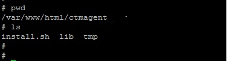

# BMC ControlM Agent Upgrade and Patch Utility

The utility will help perform the BMC ControlM Agent remote management. Any upgrade and/or patch activity can be performed using the utility over any number of agent server.

Table of Content

1. Overview

        1.1. Introduction
        
        1.2. Advantage
        
        1.3. Quick Installation
        
2. Tool technical overview

        2.1. Tool Directory layout
        
        2.2. Execution Process
        
        2.3. Troubleshooting
        
3. Limitation and upgrade

4. Support and managebility

## 1. Overview

### 1.1. Introduction

Today even in a mid size enterprise using BMC ControlM scheduling tool we have hundreeds to thousand host configured with ControlM Agent. It poses a considerable challenge in upgrading, patching Agents manually.

If that is a problem you are facing then this tool is your solution. This tool will help in migration of Agent from any version to any version. You also have options to selectively upgrade/patch agents.

### 1.2. Advantage

Below are the basic advantages that the tool has:

        1. Completely configurable as to which is your source version and what is your target version.
        
        2. You can use the same tool to run multiple parallel version migration over a disjoin set of agents with different requirement.
        
        3. Extremely simple tool written with no additional requirements other than few basic Linux utility.
        
        4. Auditable inbuild logging support, report generation support.
        
        5. Tool follows a inbuild rollback mechanism incase failure in upgrade.
        
        6. No worry of unsuccessful upgrade/patch leave agent binary corrupted, tool raises immediate alert in case upgrade/rollback failure.
        

### 1.3. Quick Installation

The tool has a extremely simple install process. It comprosed of three steps to be performed in the central server from where you are going to run your utility centrally.

1. Install Apache(used to distribute binary to the agent host) and SSHPass Utility.

        yum -y install sshpass
        
        yum -y install httpd
        
        service httpd start
        
        chkconfig httpd on

2. Download the tool library and place it in your Apache Doc Root(i.e. /var/www/html/).

        cp -r ctmagent /var/www/html/ctmagent
        
        chown -R apache:apache /var/www/html/ctmagent
        
        chmod a+rx /var/www/html/ctmagent/install.sh
        
        
3. Configure the tool for a specific migration case by running the install.sh.
        
The installation setup actually lay down a skeleton for tool, from here on you should use the tool to create a miragtion scenario where you give the tool data about the next migration that you want to perform using the tool. Migration setup is build by runnning a install.sh script, this script gather details about your next planned migration and the data that is required for the same based on the information provided the tool setup and install the component for the migration you planned next.

The below execution trail shown below shows one such migration setup, note few important points below.
- You should upload the installation binary to the tool host from BMC and made available to the tool to set the same.
- In case if you do not have binary available for any perticular flavour, please create dummy file to be provided to the script. But note in case script detects any of your host of that flavour the patch will obviously as expected to fail.
        
Dummy walk through of the setup process:

        
Just to make you understand what all have been done lets view the directory structures along with files created with the setup process.

Before setup process:

After setup process:

As you see the below components are created:
- An lancher script to initate this migration scenario, you just need to create a host file and execute the migration(detail later).
- An directory containing sub folders for all flavour contains data to be transfered to the agent host and perform the actual migration.
- Log directory to preserve logs for this perticular migration scenario.

Note: All above operation need root priviledge on the tool host. 

## 2. Tool technical overview

### 2.1. Tool Directory layout

### 2.2. Execution Process

### 2.2. Troubleshooting

## 3. Limitation and upgrade

## 4. Support and managebility
